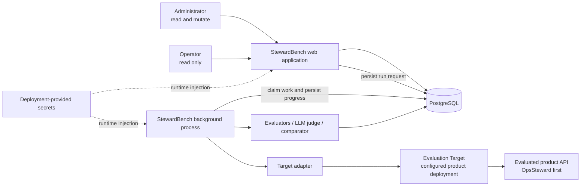
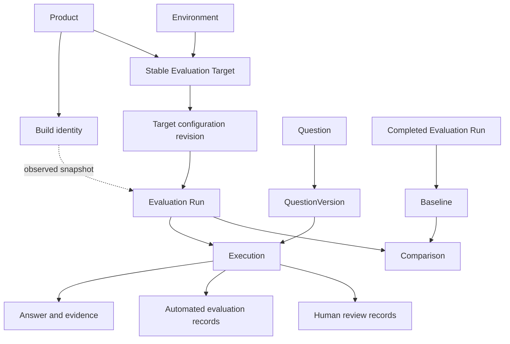
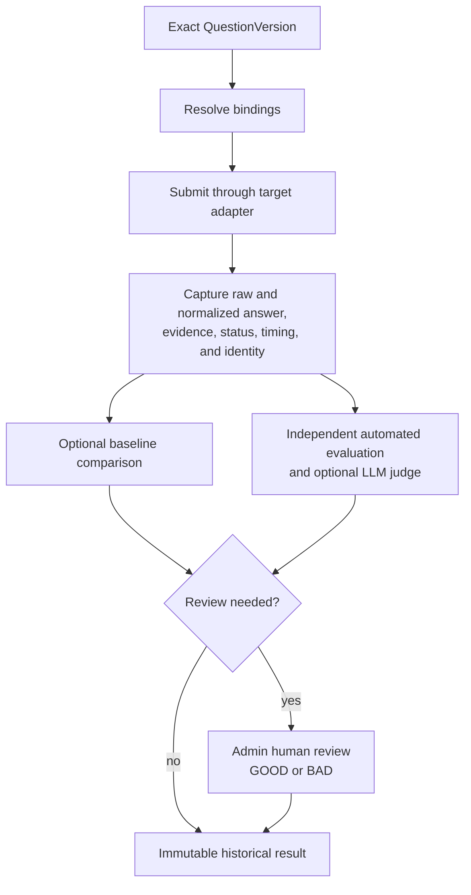
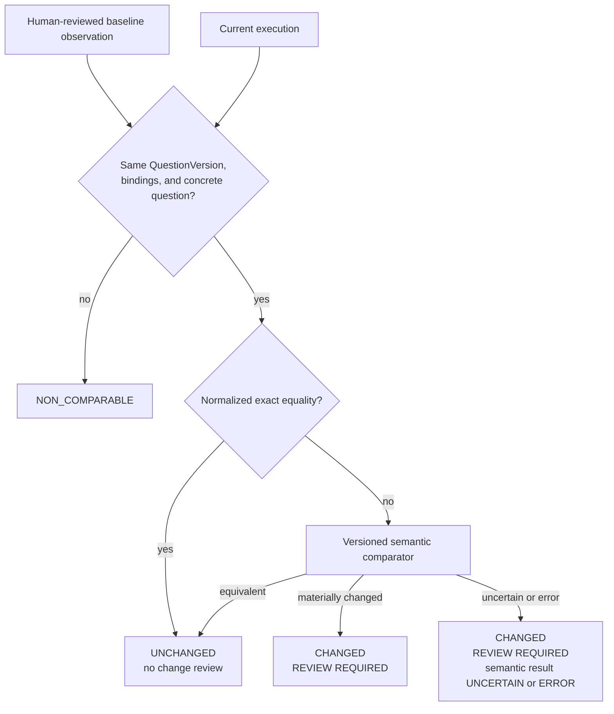

# Architecture

Status: Authoritative logical architecture for StewardBench v1. The technology
realization is selected in [Framework selection](framework-selection.md) and
[ADR 0007](adr/0007-django-monolith-and-postgresql-worker.md).
The independent evidence architecture is selected in
[ADR 0008](adr/0008-layered-executable-acceptance-harness.md) and detailed in
[Executable acceptance harness design](acceptance-harness-design.md).

## Architectural goals

The architecture exists to make the core loop reliable and auditable:

> select → execute in background → preserve → review → baseline → rerun →
> compare → review only what needs attention

The design must support multiple products, product builds, environments, and
targets while keeping the first implementation small. It must survive browser
navigation and process restarts, preserve historical identity, and keep
presentation, target-specific integration, orchestration, and evaluation logic
separate enough to be reused later.

## System context

The web application and worker are distinct process roles packaged from one
Django codebase and application image. PostgreSQL is also their durable work
queue/state authority. No diagram element implies a separate service, broker,
or repository.

## Architectural boundaries

### Presentation boundary

The web UI renders operational views and calls application services. It does not
own run orchestration, comparison rules, authorization policy, or persistence
rules. This boundary prevents future read APIs and a user-facing CLI from
reimplementing behavior.

All evaluated-product output is untrusted. Render answers and evidence as
escaped text or explicitly sanitized supported formats; never execute returned
HTML or JavaScript.

### Application-service boundary

Application services implement use cases such as:

- create a versioned question;
- launch a run from a stable selection snapshot;
- record execution progress and terminal observations;
- append a human review, comment, or validity decision;
- promote a completed run to a baseline;
- compare a run with a baseline; and
- project dashboard and list metrics.

Services enforce role checks and invariants independent of the calling UI.
Transactions protect state changes and worker claims.

### Domain boundary

The domain defines product-independent identities, histories, and state
dimensions. OpsSteward and AmLight appear only as records and adapter
configuration. The exact model is specified in [Domain model](domain-model.md).

### Target-adapter boundary

A target adapter translates normalized StewardBench requests into a supported
evaluated-product API and translates responses/errors back into normalized
observations. The execution engine cannot depend on OpsSteward-specific routes
or payload shapes. Adapter responsibilities and the proposed metadata contract
are in [Target adapter contract](target-adapter-contract.md).

Target adapters do **not** calculate network truth and do not query GitHub,
Neo4j, Nautobot, Kytos, Kafka, or similar systems as answer oracles. MCP is a
future interaction adapter and is not implemented in v1.

### Resolver boundary

A resolver produces concrete variable bindings before submission. v1 must
support:

- fixed/admin-defined values, including control/canary objects;
- baseline-frozen values for controlled comparison; and
- optional dynamic resolvers only when reliable and inexpensive.

Resolver access is distinct from authoritative-answer derivation. A resolver
may locate an object without making claims about the correct answer.

The model may also reference a lightweight historical fixture: an admin-defined
environment and frozen time window with fixed parameters/bindings for cases such
as a known BGP, BFD, interface-flap, Rubin-impact, topology-change, or quiet
period. A fixture is selection context, not a snapshot of operational systems and
not an answer oracle. Completing a fixture library is not a v1 launch blocker.

### Evaluator boundary

Evaluators consume immutable execution observations and emit independent,
versioned results. Deterministic/policy evaluators, expected-cannot-conclude
logic, LLM judges, and semantic comparators remain distinguishable. An evaluator
failure is recorded against that evaluator and never converted into product BAD
or FAIL.

The semantic comparator determines whether human attention is needed; it is not
a correctness authority. Human GOOD/BAD is authoritative when present.

### Authentication boundary

v1 uses local usernames/passwords and exactly ADMIN and OPERATOR roles. Password
verification, session management, and principal lookup are isolated from domain
services. Authorization remains in application services/server-side policy so a
future identity provider cannot bypass it.

### Persistence boundary

PostgreSQL is the only supported application database from day one. Repositories
or equivalent persistence interfaces may isolate queries, but no SQLite
compatibility layer is required. Relational structures hold core entities and
relationships; JSONB holds flexible raw request/response evidence and evaluator
payloads where their shape genuinely varies.

## Major conceptual components

| Component | v1 responsibility | Explicit exclusions |
| --- | --- | --- |
| Web application | Authenticated UI, validation, role enforcement, service invocation, progress polling, exports if inexpensive | Long-lived request for a run; product-specific API logic |
| Application services | Domain use cases, transactions, invariants, projections | HTML concerns; direct vendor payload parsing |
| Run coordinator | Persist run plan, schedule/claim work, respect policy, recover interrupted work, finalize run | Sophisticated distributed scheduling or adaptive throttling |
| Background worker | Resolve bindings, invoke adapter, capture observations, trigger configured evaluators/comparison | Dependence on an open browser request |
| Target adapter registry | Select compatible adapter/version from target configuration | Operator-capability flags or hard-coded OpsSteward core logic |
| Resolver registry | Fixed, frozen, and narrowly justified dynamic binding resolution | Comprehensive ground truth |
| Evaluation services | Independent evaluator records, LLM judge records, conservative semantic comparison | Composite proprietary score or overwriting prior results |
| Comparison service | Match comparable observations, run exact/semantic comparison, produce orthogonal change dimensions | Treating similarity as correctness |
| PostgreSQL | Durable domain records, raw textual/structured evidence, work/progress state | Object blobs, secret values, entire model as opaque documents |

## Core relationships

Product builds and stable targets are independent. A target may execute many
builds over time, and one build may be deployed to multiple targets. A target
revision identifies effective endpoint/configuration, while each run also
freezes the build metadata actually observed.

The dotted build link means a run captures observed or admin-declared build
identity; a mutable target setting never rewrites it. Unknown fields are valid.

## Evaluation lifecycle

Automated work may complete after the product response, but every result is
append-only/versioned. Human review does not overwrite it.

## Run initiation and durable plan

Launching a run is a short authenticated transaction, not the execution itself:

1. Validate ADMIN role, target status, adapter capability, and policy.
2. Resolve the user's selection into a stable **run manifest**. `Select All`
   means all eligible questions matching the current filter at launch time, not
   future questions and not merely the current page.
3. Store one target revision, requested mode, configured maximum concurrency,
   actual concurrency setting, timeout, optional delay, selected exact question
   versions, requested binding strategy, launching admin, and timestamps.
4. Snapshot admin-declared target/build metadata available at launch.
5. Create the PENDING run and durable work intent in PostgreSQL, then return
   promptly to a run detail page.
6. A background process claims and executes work. It appends a distinct,
   immutable runtime-metadata observation and freezes the effective identity on
   each Execution; it never rewrites the launch declaration or older history.

Selection is frozen so edits or later activation changes do not alter a queued
run. One run uses one target. Multi-target fan-out is not v1.

When the admin explicitly launches a controlled replay from a Baseline, the
manifest copies the baseline's exact QuestionVersion, concrete question, and
bindings for each selected comparable member; it never substitutes the current
QuestionVersion or a fresh object silently. A normal current-corpus run may use a
newer version, but that item is NON_COMPARABLE to the older baseline.

## Background execution architecture

A dedicated process from the Django application image polls and claims durable
run work in PostgreSQL. Run plan/work rows are the domain queue; no separate
generic job state or broker is introduced. Claims use short transactions and
row locking, including `SKIP LOCKED` where appropriate, plus claim identity and
lease/heartbeat or equivalent reconciliation metadata. Database locks are
released before remote API calls. The detailed selection and recovery
walkthrough are in [Framework selection](framework-selection.md).

The worker must meet these behaviors without Celery, Redis, Kafka, or
Kubernetes:

- the browser may navigate away immediately after launch;
- durable work and progress live in PostgreSQL, not only process memory;
- at most one worker owns an individual work item at a time;
- claims have enough lease/heartbeat or reconciliation information to detect an
  interrupted worker;
- retries of internal delivery are idempotent and cannot create duplicate
  terminal observations unnoticed;
- sequential mode has one in-flight target request;
- parallel mode never exceeds the lesser of requested and target-allowed
  concurrency;
- the actual concurrency setting used is retained;
- optional inter-question delay and per-question timeout are enforced;
- a single question failure does not discard completed siblings;
- a target that is unreachable fails cleanly and visibly;
- the UI can poll run projections for total, completed, running, pending,
  error/timeout counts, and elapsed time; and
- restart reconciliation either resumes safe unstarted work or records an
  explicit infrastructure error. It never overwrites a response already
  captured.

The worker dispatches through a bounded I/O executor. Sequential mode admits
one in-flight target request. Parallel dispatch respects the requested run
limit and target maximum, including aggregate active work for the same target.
The initial Docker topology uses one worker container; claim semantics preserve
a safe path to additional worker replicas if later measurements justify them.

At-most-once network side effects cannot be assumed when a process dies after a
target accepts a request but before StewardBench records the response. v1
questions should be read-only. The coordinator must record ambiguous attempts
as benchmark-infrastructure errors rather than silently resubmitting and
pretending continuity. A deliberate user retry always creates a new run.

### Lifecycle states

EvaluationRun processing states:

| State | Meaning |
| --- | --- |
| PENDING | Durable selection exists; background processing has not started. |
| RUNNING | At least one planned item has started or the coordinator is actively dispatching. |
| COMPLETED | All planned items reached a terminal execution outcome without ERROR/TIMEOUT. Answer quality may still be GOOD, BAD, or unreviewed. |
| COMPLETED_WITH_ERRORS | Processing finished and one or more items ended in ERROR or TIMEOUT; completed observations remain usable. |
| FAILED | A run-level infrastructure/configuration failure prevented meaningful dispatch or finalization. It is not a product-quality judgment. |

`CANCELLED` is conditional on the unresolved v1 cancellation decision. If
adopted, cancellation is cooperative: completed/in-flight observations remain,
unstarted work is marked clearly, and the run remains historical. Pause/resume
is not planned.

Execution processing states:

| State | Meaning |
| --- | --- |
| PENDING | Durable execution intent has not begun. |
| RUNNING | Binding resolution or a target interaction is in progress. |
| SUCCESS | A complete response was captured. This does not imply GOOD. |
| ERROR | No valid complete answer was captured because target/adapter/infrastructure handling failed. |
| TIMEOUT | The configured question timeout elapsed. |

If cancellation is selected, an explicit terminal state for unstarted cancelled
items must be designed with it. Execution outcome never contains GOOD, BAD,
PASS, or FAIL.

Processing state is necessarily updated while work is active. Once an
Execution reaches a terminal outcome, its question, request, response, evidence,
timing, binding, and identity observation are immutable. Reviews, evaluator
records, comparisons, comments, and validity decisions are separate append-only
or attributed records; they do not mutate the captured observation.

## Target execution policy

Each target revision carries a deliberately small policy:

- default mode: sequential or parallel;
- maximum concurrency, a positive bounded integer;
- question timeout;
- optional inter-question delay.

Production targets should default conservatively. The UI may warn and require a
simple confirmation for a large production run. Health warnings are generally
advisory; an unreachable target produces explicit execution errors. There is no
adaptive throttling, token bucket, or general workload orchestrator in v1.

Parallelism affects latency and product behavior. Run history always retains
requested mode, configured target maximum, and actual concurrency setting.
Performance views must not silently present sequential and parallel runs as
equivalent conditions.

## Baseline and comparison architecture

A Baseline is an immutable named reference to a completed run and its captured
membership. Its active/inactive designation may change with attribution, but its
name, referenced observations, and creation identity are not rewritten.

Comparison records retain comparator identity/version and inputs or references
needed to reproduce the decision. Change state is one of UNCHANGED, CHANGED, or
NON_COMPARABLE. Comparator semantic outcome and errors are separate fields.
Execution failures and human GOOD/BAD transitions are separate dimensions shown
alongside change state.

If a baseline's frozen binding can no longer be submitted, no replacement is
chosen. The item is NON_COMPARABLE and surfaced. A normal, non-controlled run may
resolve fresh objects independently.

Answer-change comparison also requires usable VALID baseline and current
answers. A baseline/current ERROR or TIMEOUT, or a baseline observation later
marked INVALID, has no trustworthy answer pair and is NON_COMPARABLE for answer
change while its execution failure/validity remains a separate prominent flag.
Existing comparison records are not rewritten after later invalidation.

## Storage boundaries and retention

### Relational core

Use relational modeling and constraints for users, products, builds, environments,
targets/revisions, questions/versions, scenarios/turns, runs, executions,
bindings, reviews, comments, baselines, comparisons, evaluator identities, and
result headers. Migrations are version-controlled and development also uses
PostgreSQL.

### JSONB and text

JSONB is appropriate for variable-shaped raw responses, returned evidence,
sanitized request metadata, optional runtime metadata, evaluator payloads, and
LLM-judge dimensions. Frequently filtered identities and states remain typed
relational columns even if also represented in raw payloads.

Store both:

- **raw answer/response:** exact immutable product output; and
- **display/normalized answer:** derived safe representation for rendering,
  whitespace handling, and cheap comparison.

Normalization cannot change facts, erase entities, remove malformed content or
internal-code leakage, or substitute for the raw observation. Preserve a
normalizer identity/version if normalization can evolve.

### What is not stored

- Usable target credentials, tokens, authorization headers, or secret-bearing
  URLs are never copied into evidence, diagnostics, comments, or exports.
- There is no per-run snapshot of Neo4j, Nautobot, Kytos, Kafka, or other
  operational systems.
- Generated diagrams/presentation artifacts are not persisted by default.
- v1 does not introduce object storage. If later evaluation makes binary visual
  artifacts first-class, add an abstraction based on actual volume and include
  checksum, MIME type, size, and location metadata.

### Retention

Runs, executions, evidence, evaluator results, reviews, comments, versions,
baselines, comparisons, and identity snapshots are retained indefinitely by
default. The normal UI offers no deletion of run/execution history. v1 has no
archival, partitioning, or retention-policy infrastructure.

## Build and configuration identity

Every run freezes identity observed at execution time:

- product and stable target;
- target configuration revision;
- product version, if known;
- Git SHA/build identifier, if known;
- run/execution timestamps;
- exact QuestionVersion;
- evaluator, comparator, judge, prompt, and normalizer versions used.

Optional metadata may include image SHA, model, embedding model, prompt/config,
planner/router, RAG configuration, and data freshness. Those fields cannot delay
v1. The evaluated product is the preferred source of deployed identity. Admin
declarations fill missing fields. Unknown is stored as unknown—never guessed.
StewardBench v1 does not query GitHub to reconstruct deployments.

Target endpoint/configuration changes create a new target revision. They never
rewrite historical runs. Discovered metadata snapshots are immutable; factual
corrections are append-only comments/annotations.

## Security boundary

Although v1 is expected behind a firewall, it requires normal application
security:

- modern password hashing and safe first-admin bootstrap;
- authenticated access with secure session handling;
- server-side role enforcement for every mutation and protected read;
- CSRF protection where the selected interaction model requires it;
- input validation and output encoding;
- safe rendering of all product-provided text/evidence;
- secrets supplied through environment variables, Docker secrets, or equivalent
  deployment injection;
- credential references in target data, never usable secrets;
- strict redaction before durable logs, error messages, evidence, and exports;
- bounded request sizes, timeouts, and safe diagnostic capture; and
- no assumption that an HTTP 200 payload is safe, well-formed, or GOOD.

StewardBench is not a replacement for OpsSteward-Sec and is not a general
adversarial security-evaluation platform.

## Deployment boundary

v1 runs with Docker and should have a development experience approximately
equivalent to `docker compose up`. The normal long-running topology is one web
container, one worker container, and PostgreSQL. Web and worker use the same
Django application image/codebase with different entry points; migrations run
as an explicit one-shot deployment step.

No Kubernetes, Redis, Kafka, Celery, or separate API/frontend service is part
of v1. Configuration, health, stateless web-process behavior, restartable worker
behavior, and migration boundaries allow the web and worker roles to become
separate Kubernetes workloads in v2 without a domain redesign.

## Observability and performance data

At minimum capture:

- run `started_at` and `completed_at`;
- execution request/start and completion timestamps;
- `latency_ms` with a documented clock definition;
- ERROR/TIMEOUT outcomes and sanitized diagnostic class/message;
- requested execution mode;
- configured target maximum concurrency; and
- actual concurrency setting used.

These support total duration, average latency, p50/p90/p95, questions per minute
or second, error rate, timeout rate, and parallel efficiency later. v1 should
capture raw timing correctly before building sophisticated benchmarking.

## API and future callers

The web UI is the v1 operational interface. Useful read endpoints may be exposed
when inexpensive, but comprehensive REST parity and API-triggered evaluation are
not requirements. Application services—not presentation handlers—remain the
single behavior boundary so future API and v3+ CLI callers can reuse execution,
review, baseline, and comparison rules.

Likely future read resources include questions, runs, executions, baselines, and
comparisons. Listing them does not commit v1 to complete REST coverage.

## Failure attribution

Failure ownership must remain visible:

| Failure source | Representation | Must not become |
| --- | --- | --- |
| Target/adapter authentication, connection, malformed response, unsupported API, timeout | Execution ERROR/TIMEOUT plus sanitized diagnostics | Automatic human BAD |
| Resolver cannot produce required fixed/frozen binding | Infrastructure error or NON_COMPARABLE in a comparison, depending on stage | Product FAIL |
| Deterministic evaluator exception | Evaluator ERROR record | Product BAD/FAIL |
| LLM judge unavailable/malformed | Judge ERROR record | Product BAD |
| Semantic comparator timeout/malformed output | Comparator ERROR/UNCERTAIN and REVIEW REQUIRED | UNCHANGED |
| Valid successful answer judged unacceptable | Human BAD and/or independent evaluator FAIL | Transport ERROR |

This separation prevents StewardBench defects from being attributed to the
evaluated product.

## Acceptance boundary

StewardBench's own executable acceptance is layered rather than one opaque
end-to-end suite. Domain/service and Django request tests prove deterministic
semantics and server-side RBAC; real PostgreSQL proves persistence, migration,
locking, claim, lease, and concurrency behavior; a reusable deterministic fake
target independently observes remote submissions; selective Playwright proves
high-value browser behavior; and Docker smoke proves the deployable
web/worker/PostgreSQL topology.

Routine acceptance does not require live OpsSteward or live LLM services.
Optional live-target and real-model calibration checks are separately
configured and reported. Harness, fixture, database, worker, adapter,
evaluated-target, evaluator/judge, comparator, and environment failures remain
distinguishable from StewardBench product failures. See
[Executable acceptance harness design](acceptance-harness-design.md).

## Extensibility points—not v1 commitments

- new product API adapters and later MCP adapters;
- dynamic resolvers and narrowly scoped authoritative evaluators;
- alternative identity providers behind the authentication boundary;
- read/automation APIs and a CLI around application services;
- Kubernetes process deployment;
- evaluator re-execution over retained answers;
- artifact storage abstraction if real evaluated artifacts require it; and
- CI triggers and, much later, evidence-based gating.

Extensibility means preserving boundaries and evidence, not implementing
speculative infrastructure now.
