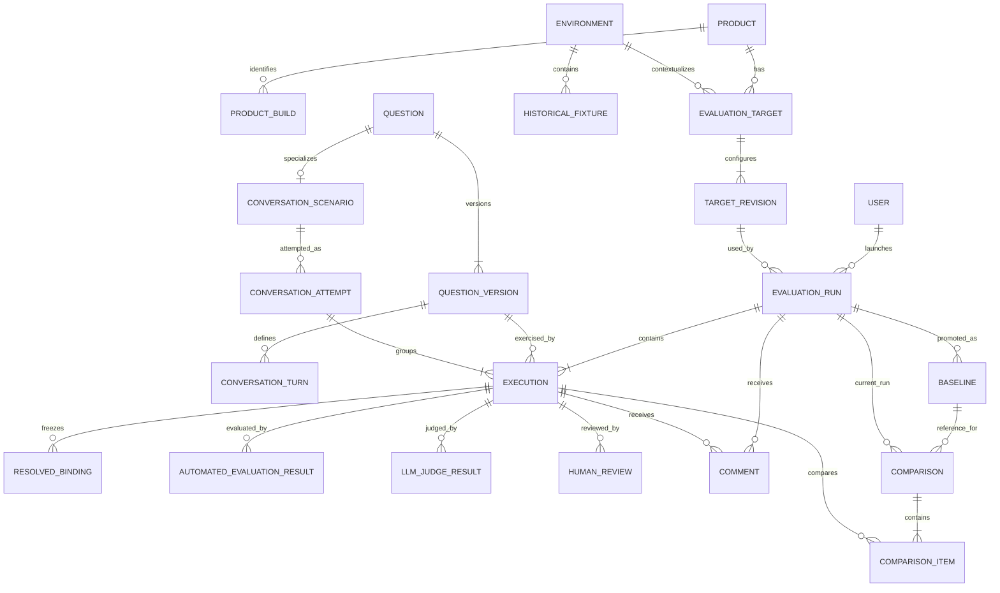

# Domain model

Status: Authoritative conceptual/logical model. It is intentionally not a SQL
schema; the selected implementation must later translate these concepts into
tables, keys, constraints, and migrations without weakening the invariants.

## Modeling approach

StewardBench separates stable identities from temporal definitions and captured
observations:

- a **Product**, **Environment**, **EvaluationTarget**, or **Question** is a
  stable identity;
- a target configuration revision and QuestionVersion describe change over time;
- an EvaluationRun freezes an operation plan and effective target/build context;
- an Execution freezes one outbound interaction and its response; and
- evaluations, reviews, comments, validity decisions, baselines, and comparisons
  add attributed facts without rewriting the observation.

Product builds do not sit inside target identity. The same target can serve many
builds, and the same build can appear at multiple deployments.

## Relationship overview

The diagram omits creator/reviewer user links and several identity snapshots for
legibility. A ConversationAttempt is the minimal grouping required to keep
turn-level Executions ordered and on one session; it does not create a general
workflow engine.

## Configuration and identity entities

### Product

Stable identity of an evaluated AI network-operations system. Suggested
attributes include an internal ID, unique name/slug, display name, description,
active flag, and created attribution. OpsSteward is seed data, not a special
type.

### ProductBuild

An optional normalized identity for a known build of a Product. It can hold
product version, Git SHA/build identifier, image SHA, and flexible non-secret
metadata. A precise Git SHA/build identifier is stronger identity than release
version alone.

Runs always retain their own immutable **BuildSnapshot**, even when linked to a
normalized ProductBuild. This protects history from later reconciliation. A
snapshot distinguishes observed runtime fields from admin-declared fallback
fields and permits unknown values. It includes observation time/source.

### Environment

Stable logical operational/data context, such as AmLight Production. It is not a
deployment endpoint and is not assumed to belong to one Product. Suggested
attributes are ID, name/slug, description, active flag, and created attribution.

### EvaluationTarget

Stable administrative identity of a queryable Product deployment/interface. It
belongs to one Product and one Environment for its lifetime in v1; moving it to
a different Product or Environment creates a new target identity. It has a
current active or retired/inactive administrative state. Historical deployments
are inactive targets, not a separate classification.

The effective TargetRevision carries a classification of:

- PRODUCTION;
- DEVELOPMENT;
- STAGING;
- LAB_TEST; or
- EXTERNAL.

`HISTORICAL` is not a classification. The model does not assume one target per
build or one target per endpoint.

### TargetRevision

An immutable effective configuration revision for a target. A new revision is
created when execution-relevant configuration changes. It contains:

- adapter type and adapter configuration/version selector;
- endpoint(s) or non-secret connection configuration;
- reference(s) to externally injected credentials, never secret values;
- target classification effective for the revision;
- declared technical capabilities such as question API, conversation/session
  API, and runtime metadata availability;
- default sequential/parallel mode;
- maximum concurrency;
- question timeout;
- optional inter-question delay;
- admin-declared build metadata fallback; and
- validity/effective dates and creation attribution.

It does not contain operator-capability claims such as L0, L1, BGP, or Rubin.
The corpus tests those capabilities.

Each run references the exact TargetRevision and also stores a compact immutable
TargetSnapshot so history remains understandable even if administrative display
records later change.

### User

Authenticated local identity with username, password hash, active state, and
exactly one v1 role: ADMIN or OPERATOR. Password material is never exposed to
domain exports. Important state changes reference the responsible User and
timestamp.

## Question entities

### Question

Stable longitudinal identity for an operator capability. It has:

- stable human-readable ID plus internal ID;
- kind: SINGLE_TURN or CONVERSATION;
- lifecycle: DRAFT, ACTIVE, or RETIRED;
- one required controlled domain;
- zero or more free-form lightweight Unicode tags;
- optional rationale; and
- creation/change attribution.

Domain is controlled because it is a longitudinal reporting dimension. Tags are
deliberately lightweight and may include `Rubin`, `Portuguese`, `temporal`,
`conversation`, `RCA`, `control`, or `canary`. v1 has no taxonomy subsystem,
priority, or criticality. Every active question is a requirement.

Question origin/provenance is not required. Workbook source traceability belongs
to LegacyImportBatch/LegacyObservation records rather than becoming mandatory
metadata for every Question.

Lifecycle means:

- **DRAFT:** editable preparation, not normally eligible for runs;
- **ACTIVE:** eligible for selection and execution; and
- **RETIRED:** not selected for new normal runs, but all history remains.

### QuestionVersion

Immutable evaluation-relevant definition of a Question. It contains:

- version ID/sequence and exact question template;
- declared variables/placeholders and binding requirements;
- optional evaluation guidance, including imported legacy expected-answer notes;
- `valid_from` and nullable `valid_to` (`NULL` means current);
- optional change classification:
  `PRODUCT_REQUIREMENT_CHANGE`, `TEST_BUG_FIX`, `GROUND_TRUTH_UPDATE`, or
  `DATA_MODEL_EVOLUTION`;
- optional change reason; and
- creation attribution.

Evaluation-relevant edits create a new QuestionVersion and close the prior
version's temporal range. At most one version for a Question is normally current
at an instant. Overlap is prevented by service validation and, where practical,
database constraints. Executions always reference the exact version.

### ConversationScenario and ConversationTurn

A ConversationScenario is the stable conversation-specific companion to a
Question of kind CONVERSATION. Its ordered ConversationTurns belong to an exact
QuestionVersion so material transcript changes are versioned. Each turn has a
stable within-version order, question template, binding references, and a
required-for-overall-result flag (normally true).

There is no independent stop-on-failure setting: all turns are attempted in
order using the same target session identity. The model preserves Unicode and
does not assume English.

### BindingDefinition and ResolvedBinding

A variable definition belongs to a QuestionVersion or versioned conversation
turn and specifies its name and expected value shape without encoding an
answer oracle. A ResolvedBinding is the concrete immutable name/value used for
an Execution, with resolution mode:

- FIXED_ADMIN;
- DYNAMIC; or
- BASELINE_FROZEN.

It also records resolver identity/version where applicable and a safe display
form. Baseline comparison reuses the exact baseline values. If they are no
longer valid, comparison becomes NON_COMPARABLE instead of resolving a new
object silently.

The exact **submitted question** is stored separately after substitution. This
prevents a later renderer or template change from altering history.

### HistoricalFixture

A lightweight optional record for a known historical network window. It belongs
to an Environment and contains a stable ID/name, start/end timestamps, optional
description/tags, and fixed non-secret parameters or binding values. Examples
may include positive BGP/BFD/interface-flap windows, Rubin-impact or topology
change windows, and quiet/no-event windows.

A fixture is a reproducible input context, not an operational-system snapshot,
ground-truth answer, or special evaluator. An Execution freezes any fixture
reference and concrete values through ResolvedBindings. Fixtures may be populated
progressively; an incomplete fixture library does not block v1.

## Execution entities

### EvaluationRun

One admin-triggered evaluation operation against exactly one TargetRevision,
containing one or more selected executions. A run contains:

- immutable run ID and stable selection/plan snapshot;
- target and target-revision snapshot;
- observed/admin-declared BuildSnapshot;
- requested mode: SEQUENTIAL or PARALLEL;
- configured maximum concurrency and actual concurrency setting used;
- question timeout and optional delay used;
- lifecycle state and run-level sanitized diagnostics;
- `created_at`, `run_started_at`, `run_started_by`, and `completed_at` as
  applicable;
- optional source-run/source-execution links for rerun or retry; and
- optional selected Baseline reference used to request comparison.

Lifecycle states are PENDING, RUNNING, COMPLETED, COMPLETED_WITH_ERRORS, and
FAILED. Conditional CANCELLED behavior is deferred to the open cancellation
decision. A completed run is never reopened to append retry work.

The plan stores total selected items even if execution rows are created lazily,
so progress remains durable and stable.

### Execution

One attempt to submit one single question or one conversation turn. It belongs
to one EvaluationRun and references the exact QuestionVersion; conversation
turns also reference their ConversationAttempt and turn definition. It stores:

- PENDING/RUNNING/SUCCESS/ERROR/TIMEOUT processing state;
- exact submitted question and immutable resolved bindings;
- request/start/completion timestamps and latency;
- sanitized raw request representation;
- HTTP/protocol status when applicable;
- exact raw product response and exact raw answer;
- derived display/normalized answer and normalizer identity;
- returned evidence/provenance;
- captured evaluation evidence;
- target, target-revision, and BuildSnapshot effective for the attempt;
- sanitized target/adapter error class and diagnostics; and
- links to related/retry source executions.

SUCCESS only means a complete response was captured. ERROR and TIMEOUT mean no
valid complete response. None of these states mean GOOD, BAD, PASS, or FAIL.

The execution observation becomes immutable at terminal state. Later records
may evaluate, review, compare, comment on, or invalidate it without altering its
captured fields.

### ConversationAttempt

Groups the ordered turn Executions for one complete scenario attempt and stores
the target's non-secret conversation/session identity. It belongs to one run and
one scenario/version. A failed turn does not stop subsequent turns. Retry creates
a new run and ConversationAttempt beginning at turn 1.

Overall human result is derived: GOOD only if all required turn Executions have
an authoritative GOOD review. Any required BAD produces BAD; otherwise the
conversation remains unreviewed/incomplete. Transport failures are shown
separately and prevent an all-GOOD conclusion until handled.

## Evaluation and review entities

### AutomatedEvaluationResult

An immutable result from one explicit evaluator mechanism and version. Fields
include evaluator identity/version, mechanism, execution reference, created
time, status, optional outcome, structured details/evidence, and sanitized error.

Mechanisms remain visible, for example deterministic, policy, and
expected-cannot-conclude evaluators. A successful result may be PASS, FAIL, or
CANNOT_CONCLUDE as supported by that evaluator. Evaluator ERROR has no product
outcome and is not converted to FAIL/BAD. Later reevaluation appends a new
versioned result rather than overwriting one.

### LLMJudgeResult

An immutable advisory evaluation with judge provider/model identity, judge
version, prompt/version, timestamp, processing status, structured dimensions,
overall advisory output if configured, evidence/rationale payload, and sanitized
error. Dimensions may include grounding, completeness, directness, operator
usefulness, calibrated uncertainty, and language quality. No manual 1–5 score is
introduced. Later judge versions can evaluate the stored answer without
rerunning the product, but v1 has no bulk regrading UI.

### HumanReview

An immutable admin review event containing GOOD or BAD, reviewer, timestamp, and
optional comment reference/text. Human judgment is authoritative when present
but does not delete or alter automated results.

No voting, multiple-independent-reviewer, or adjudication workflow exists. If a
mistake must be corrected, append an explicitly linked correction review (and/or
comment) so the accepted projection uses the latest correction while all review
history remains visible. Silent editing is forbidden.

### ReviewTracking

Review state is independent of HumanReview judgment:

- NONE: no change-driven review is needed;
- REQUIRED: human attention is outstanding; or
- REVIEWED: the required review action was completed.

The state change is attributed and preserves its cause/reference (for example a
ComparisonItem or manual flag). A review may exist even when change-driven state
is NONE, such as initial baseline review. REVIEWED does not mean GOOD; it means
the required work was completed.

| Example | Review state | Accepted human judgment |
| --- | --- | --- |
| No review needed | NONE | absent |
| Change detected, not reviewed | REQUIRED | absent |
| Human accepts changed answer | REVIEWED | GOOD |
| Human rejects changed answer | REVIEWED | BAD |
| Error triaged with no usable answer | REVIEWED | absent |

ADMIN may mark REQUIRED work REVIEWED without creating a HumanReview when no
usable answer exists or the attention item is purely infrastructural. The
attributed review-state event and optional Execution/Run Comment record that
triage; no GOOD/BAD value is invented.

### ExecutionValidityDecision

Executions default to a current projection of VALID. An admin may append an
INVALID decision with timestamp, actor, and optional comment; correction must be
another attributed event rather than deletion or silent edit. INVALID excludes
the execution from normal product-quality metrics but never deletes it.

If an execution referenced by a baseline becomes INVALID, the baseline is
flagged for admin attention. The baseline membership/history is not rewritten.

### Comment

Append-only text attached to exactly one EvaluationRun or Execution. It records
author, timestamp, and Unicode text. Admins create comments; all authenticated
users can read them. Corrections are new comments. There are no threads,
replies, mentions, reactions, editing, or complex attachments.

## Baseline and comparison entities

### Baseline

A named immutable reference to one completed EvaluationRun and its execution
membership as observed at promotion. Fields include name, run, description if
needed, `baseline_created_at`, `baseline_created_by`, and active/inactive
administrative designation with attribution.

The referenced content never changes. Active state may be toggled without
deleting the Baseline or run. More precisely, baseline membership, captured
answers, versions, bindings, target/build identity, and creation attribution are
fixed. Later HumanReview, Comment, or validity events may be appended to member
Executions and are shown as later history; they do not alter the baseline
observation. Multiple named baselines may coexist. Promotion shows, but need not
block on, completeness counts such as total, human reviewed, not reviewed,
invalid, and execution errors.

A Baseline may contain GOOD and BAD observations. Reproducing a baseline's BAD
answer does not make the current answer GOOD. Changing a BAD answer to an
independently human-reviewed GOOD answer is an improvement even though it is
different.

### Comparison and ComparisonItem

A Comparison is an analysis of one current EvaluationRun against one Baseline
using an identified comparison pipeline/version. Its per-execution
ComparisonItems store/reference:

- baseline and current Execution;
- comparability check inputs;
- change state: UNCHANGED, CHANGED, or NON_COMPARABLE;
- exact-equality result;
- semantic result: EQUIVALENT, MATERIAL_CHANGE, UNCERTAIN, NOT_RUN, or ERROR;
- comparator identity/version and structured reasoning/evidence;
- review state/cause projection; and
- timestamps.

Execution outcome and evaluator/human transitions are not packed into the
change enum. Views derive separate transitions such as GOOD → GOOD, GOOD → BAD,
BAD → GOOD, BAD → BAD, and reviewed → unreviewed where meaningful. Errors and
timeouts also remain separate attention flags.

Comparison requires the same QuestionVersion, exact resolved binding set, same
concrete submitted question where applicable, and usable VALID baseline/current
answers. Absence or invalidity of a frozen binding, an INVALID source
observation, or an ERROR/TIMEOUT without an answer pair produces
NON_COMPARABLE for answer change. The failure and validity remain orthogonal
attention flags. Comparator uncertainty/error is never UNCHANGED and normally
produces REQUIRED.

A ComparisonItem references the human-review records used to derive any
displayed transition at comparison time. Later append-only correction reviews do
not rewrite that comparison; recomputation creates a new versioned comparison.

If comparison is recomputed with a new comparator version, append a new
Comparison/result set or versioned items; never overwrite the earlier behavior.

## Legacy import entities

Workbook history may lack target, build, timestamp, or binding identity required
for a controlled Execution. Preserve it through an attributed **LegacyImportBatch**
and **LegacyObservation** linked to a Question/QuestionVersion where confidence
permits. A LegacyObservation can retain source sheet/row, answer, expectation,
acceptability, comment, timing, token values, and missing-field markers.

It is visibly legacy/uncontrolled and is not eligible for baseline membership or
controlled comparison unless migration evidence proves all required identity.
This avoids fabricating a normal EvaluationRun while preserving useful history.
See [Question corpus import](question-corpus-import.md).

## Orthogonal state summary

| Dimension | Representative values | Answers which question? |
| --- | --- | --- |
| Run lifecycle | PENDING, RUNNING, COMPLETED, COMPLETED_WITH_ERRORS, FAILED | Did orchestration finish? |
| Execution outcome | PENDING, RUNNING, SUCCESS, ERROR, TIMEOUT | Did interaction produce a complete answer? |
| Automated outcome | PASS, FAIL, CANNOT_CONCLUDE, absent; evaluator ERROR separate | What did this evaluator conclude? |
| Human judgment | GOOD, BAD, absent | What does the authoritative human review conclude? |
| Review state | NONE, REQUIRED, REVIEWED | Is human attention outstanding/completed? |
| Validity | VALID, INVALID | Is this benchmark observation trustworthy for normal metrics? |
| Change state | UNCHANGED, CHANGED, NON_COMPARABLE | Is the answer meaningfully comparable/different? |

No single composite enum or score may collapse these dimensions.

## Domain invariants

These rules must later influence database constraints, transactions, and tests:

1. A historical Execution always references the exact QuestionVersion used.
2. A terminal Execution's submitted question, bindings, captured answer,
   response, evidence, timing, and identity snapshot are immutable.
3. A completed EvaluationRun is never reopened to append retries or reruns.
4. Retry creates a new EvaluationRun and Execution; conversation retry begins at
   turn 1 in a new ConversationAttempt.
5. Human review never overwrites automated evaluation or judge output.
6. Automated reevaluation, when supported, appends results and never overwrites
   an earlier evaluator result.
7. A Baseline references historical observations; it does not redefine
   correctness and may contain BAD answers.
8. Controlled baseline comparison reuses frozen binding values.
9. A missing/invalid frozen binding produces NON_COMPARABLE, never silent
   substitution.
10. Material answer change and answer correctness are independent.
11. REVIEWED means required review was completed; it does not mean GOOD.
12. INVALID never deletes an Execution or its evidence.
13. INVALID executions are excluded from normal product-quality metrics.
14. Later target/configuration/build changes never rewrite historical identity.
15. OPERATOR cannot mutate benchmark state.
16. Only ADMIN can launch, retry, or rerun evaluations.
17. Secrets never enter captured request/response evidence, diagnostics,
   comments, or exports.
18. QuestionVersion definitions have explicit temporal boundaries.
19. At most one QuestionVersion is normally current for one Question at an
   instant.
20. Live network-state changes may legitimately change factual answers.
21. Comments are append-only and authored/timestamped.
22. Comparator uncertainty or failure cannot suppress a difference as
   UNCHANGED; it produces human attention.
23. An HTTP/protocol success does not imply GOOD or PASS.
24. An evaluator failure does not imply product BAD or FAIL.
25. Baseline active/inactive changes never delete or change its referenced run.
26. Every run has exactly one target revision and one immutable selection
   snapshot.
27. Runtime metadata absence is represented as unknown, never fabricated.
28. Conversation turns retain order, share one session identity per attempt,
   and continue after individual turn failure.

## Attribution expectations

Rather than a separate general audit subsystem, state-changing records carry
appropriate fields such as `created_at/by`, `reviewed_at/by`,
`invalidated_at/by`, `run_started_at/by`, and `baseline_created_at/by`.
Append-only comments, versions, execution history, and decision records supply
the required audit trail.
